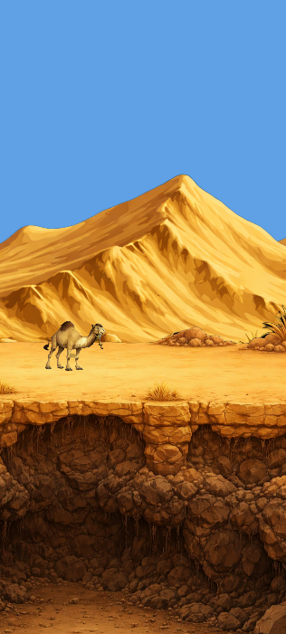

# Rudi — Press Kit

Static press kit page for **Rudi** (Endless Desert Runner).

## Quick Start

1. Open `index.html` in a browser — works locally without a server
2. Deploy via GitHub Pages (see below)

## Adding Content

### Screenshots
1. Drop 9:16 PNG files into `assets/screenshots/`
2. Name them `screenshot-01.png` through `screenshot-06.png` (or edit `index.html` for different names)
3. Create a `screenshots.zip` containing all screenshots and place it in `assets/screenshots/`
4. In `index.html`, the `<a href="...">` tags point to these files — replace the `<div class="placeholder-img">` with `` tags:
   ```html
   <!-- Before -->
   <div class="placeholder-img placeholder-screenshot"><span>Screenshot 1</span></div>
   <!-- After -->
   
   ```

### Logo & Artwork
1. Drop logo files into `assets/logos/` (PNG transparent + dark/light variants)
2. Drop key art / promo artwork into `assets/artwork/`
3. Create `logos.zip` and `artwork.zip` in their respective folders
4. Replace the hero logo: swap `assets/logos/logo-placeholder.svg` reference in `index.html`
5. Replace `<div class="placeholder-img">` blocks with `` tags

### Video / Trailer
Uncomment the `<iframe>` block in `index.html` and replace `VIDEO_ID` with the YouTube video ID. Delete the placeholder `<div>`.

### Texts & Info
Edit directly in `index.html`:
- **Developer name**: Search for `[Studio Name]` and replace
- **Contact email**: Search for `press@example.com` and replace
- **Social links**: Update Instagram/TikTok handles, uncomment Discord if needed
- **Descriptions**: Edit the short/long description paragraphs
- **Website URL**: Replace `rudi.game` href

## Deploying to GitHub Pages

### Option A: Separate Repo
1. Create repo `rudi-presskit` on GitHub
2. Push this folder's contents to it
3. Settings > Pages > Source: "Deploy from branch" > `main` / `/ (root)`
4. Site will be live at `https://USERNAME.github.io/rudi-presskit/`

### Option B: From Game Repo
1. Push the `docs/presskit/` folder to the game repo
2. Settings > Pages > Source: "Deploy from branch" > `main` / `/docs/presskit`
3. Or use a custom GitHub Actions workflow

## Design Customization

All colors, fonts, and spacing are defined as CSS variables at the top of `style.css`:
```css
:root {
    --sand: #E8C872;
    --teal: #3EC6C6;
    --brown: #4A3728;
    /* ... */
}
```

## File Structure
```
presskit/
├── index.html          ← Main page
├── style.css           ← Stylesheet
├── README.md           ← This file
└── assets/
    ├── screenshots/    ← Game screenshots (9:16 PNG)
    ├── logos/          ← Logo variants (PNG, SVG)
    └── artwork/        ← Key art, promo material
```
